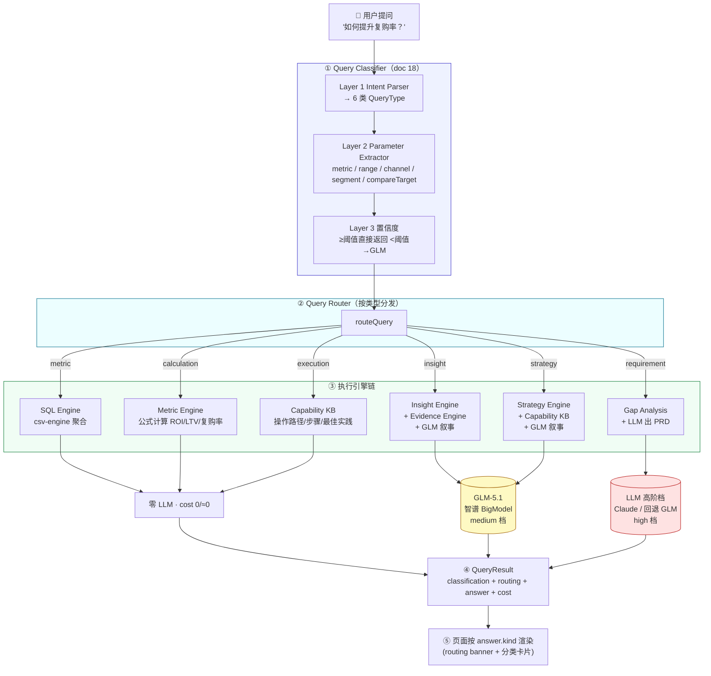

# AI 决策路由体系设计（Query Classification & Routing）

> 对齐文档：`15_AI_Cost_and_Execution_Principles` · `16_Capability_Knowledge_Base` · `17_AI_Strategy_Engine` · `18_Query_Classifier`
> 版本：V1.0 · 状态：分类与路由能力已落地（规则优先 + GLM-5.1 接线，MCP 暂缓）

---

## 0. 目标

建立企业级 **AI 决策路由体系**：用户自然语言提问 → 自动分类 → 自动路由到**最优执行路径**，
而非「所有请求直接调用大模型」。

五条铁律（doc 15）落到系统每一层：

| 原则 | 含义 | 在本体系的落点 |
|---|---|---|
| **Rule First** | 规则可解则不用 LLM | Query Classifier 规则先行，置信度足够直接返回（cost 0） |
| **SQL First** | 结构化数据用 SQL 取 | Metric/Calculation Query 走 csv-engine 聚合，附等价 SQL |
| **Evidence First** | 先取证再推理 | Insight Query 复用 Evidence Engine，结论必带数据依据 |
| **Knowledge First** | 优先查知识库 | Execution/Strategy 走 Capability KB，不调用 LLM |
| **LLM Last** | 最后才用大模型 | 仅 Insight/Strategy 叙事、Requirement 出 PRD、分类兜底时调用 |

成本目标（doc 15 §Cost Monitoring）：缓存命中率 > 60%、知识复用率 > 50%、**LLM 使用率 < 30%**、单查询均价 < ¥0.05。

---

## 1. 更新后的系统架构图



**与既有架构的关系**：本体系是**新增的决策前置层**，不替换既有 `runWorkflow`。
- 既有 `runWorkflow`（Role→Intent→Metric→Data→Insight+Governance）被复用为 **Insight Query 的执行引擎**。
- 既有 `csv-engine` 同时充当 **SQL Engine**（聚合）与 **Metric Engine**（派生指标计算）。
- 既有 `Intent`（业务域 sales/crm/channel…）与新增 `QueryType`（用户意图）**正交**：Intent 回答「什么业务主题」，QueryType 回答「想干什么」。

---

## 2. Query Classifier 设计

源码：`src/lib/routing/query-classifier.ts` · 测试：`src/lib/routing/__tests__/query-classifier.test.ts`

### 2.1 三层架构（doc 18 §Overall Architecture）

| 层 | 职责 | 实现 |
|---|---|---|
| Layer 1 Intent Parser | NL → 6 类 QueryType | 正则规则集，按优先级匹配（避免歧义） |
| Layer 2 Parameter Extractor | NL → 结构化参数 | 关键词 + `resolveMetricKey` 归一化 |
| Layer 3 置信度 | 决定是否回落 LLM | ≥0.8 直返；<0.6 且 GLM 可用 → GLM 辅助 |

### 2.2 六类查询（doc 18 verbatim）

| QueryType | 定义 | 示例 | 执行引擎 | LLM | 成本 |
|---|---|---|---|---|---|
| `metric` | 指标查询（聚合量取值） | 今天 GMV 是多少？ | SQL Engine | ❌ | 0 |
| `calculation` | 派生指标计算 | ROI/LTV/复购率是多少？ | Metric Engine | ❌ | 0 |
| `insight` | 经营归因 | 为什么 GMV 下降？ | Insight+Evidence+GLM | ✅ | 中 |
| `strategy` | 经营改善 | 如何提升复购率？ | Strategy+Capability KB+GLM | ✅ | 高 |
| `execution` | 系统操作 | 如何创建优惠券？ | Capability KB | ❌ | ≈0 |
| `requirement` | 需求设计 | 帮我生成 PRD | Gap Analysis+LLM | ✅ | 很高 |

### 2.3 规则优先级（消除歧义）

按数组顺序匹配，**先命中先归类**：

```
requirement  →  生成/写 PRD、设计(体系/方案/功能)、系统不支持怎么办
execution    →  (如何/在哪)(创建/配置/设置/开通) + 能力词
strategy     →  (如何/怎么)(提升/提高/优化) | 指标下降…怎么办
insight      →  为什么 / 原因 / 归因 / 分析一下
metric/calc  →  是多少 / 怎么样 / 多少  →  按 metricKey 是否派生量二次判定
default      →  metric 概览（SQL First，最小化 LLM，confidence 0.5）
```

**metric vs calculation 的判定**：命中取值规则后，用 `resolveMetricKey` 取指标 key，
派生指标集 `{roi, ltv, repurchaseRate, conversion, churnRate, aov, refundRate, reachRate, replyRate, scrmConversion, couponRedemption}` → `calculation`，其余 → `metric`。

### 2.4 GLM 辅助分类（doc 18 V2 · LLM Last）

- **仅在** `classifyRule().confidence < 0.6` **且** `isLlmEnabled()` 时触发。
- GLM 以 `json:true` 输出 `{queryType, confidence, reason}`，失败则**回退规则结果，绝不抛错**。
- 参数（Layer 2）**始终由规则抽取**（确定性），GLM 只修正类型判断。

### 2.5 质量指标（已达标）

`query-classifier.test.ts` 覆盖 doc 18 全部示例 + 边界，**分类准确率 > 90%**、参数提取准确率 > 90%（doc 18 §Success Criteria）。

---

## 3. Router 设计

源码：`src/lib/routing/router.ts` · 测试：`src/lib/routing/__tests__/router.test.ts`

### 3.1 路由表（doc 18 §Execution Engine）

```
metric       →  handleMetric()       →  SQL Engine          →  MetricAnswer      (free)
calculation  →  handleCalculation()  →  Metric Engine       →  CalculationAnswer (free)
insight      →  handleInsight()      →  runWorkflow + GLM   →  InsightAnswer     (medium)
strategy     →  handleStrategy()     →  strategyEngine+GLM  →  StrategyAnswer    (high)
execution    →  handleExecution()    →  Capability KB       →  ExecutionAnswer   (low)
requirement  →  handleRequirement()  →  gapAnalysis + LLM   →  RequirementAnswer (very_high)
```

### 3.2 Handler 设计要点

| Handler | Rule First 落点 | 答案关键字段 |
|---|---|---|
| **handleMetric** | csv-engine 聚合取值，附**等价 SQL** + 源系统 | `value / prev / delta / sql / sources` |
| **handleCalculation** | Metric Engine 按公式计算，附**公式 + 计算分量依据** | `formula / result / evidence[] / sql` |
| **handleInsight** | 复用 `runWorkflow`（含 Evidence + Governance）；GLM 仅生成 2-3 句叙事 | `analysis(完整 AnalysisResult) / narrative` |
| **handleStrategy** | 规则策略库命中 + Capability KB 解析能力；GLM 仅叙事 | `strategyName / audience / channel / capabilities[]` |
| **handleExecution** | Capability KB 关键词匹配，直答操作路径 | `system / module / path / steps / bestPractice / owner` |
| **handleRequirement** | `gapAnalysis` 检测缺口；LLM(high 档) 出 PRD，无 Key 时规则骨架兜底 | `supported / gaps[] / prd{}` |

### 3.3 RoutingTrace（可解释 / 可审计）

每个结果携带 `routing`，记录「**为什么这么走**」：

```ts
routing = {
  queryType, engines[],        // 实际引擎链
  ruleOrder[],                 // 决策链：①规则命中 ②SQL/知识库优先 ③LLM Last
  costTier, llmUsed, llmModel  // 成本档 + 是否/用了哪个 LLM
}
```

例：metric 路径 `ruleOrder = ["①规则命中取值诉求", "②SQL Engine 直接聚合", "③禁止 LLM 计算(doc15 P2)"]`，`llmUsed=false`。

### 3.4 成本治理（doc 18 §Cost Governance）

| 类型 | costTier | LLM | 说明 |
|---|---|---|---|
| metric / calculation | free | ❌ | 纯 SQL/Metric，0 成本 |
| execution | low | ❌ | 知识库查询，≈0 |
| insight | medium | ✅ GLM | Evidence 已取证，GLM 仅叙事 |
| strategy | high | ✅ GLM | 策略库 + KB + GLM 叙事 |
| requirement | very_high | ✅ Claude/GLM | 出 PRD，最高档 |

---

## 4. API 设计

### 4.1 `POST /api/query` —— 决策路由主入口

源码：`src/app/api/query/route.ts`

**请求**
```json
{ "question": "如何提升复购率？", "range": 7 }
```

**响应** `QueryResult`
```jsonc
{
  "question": "如何提升复购率？",
  "classification": {
    "queryType": "strategy",
    "confidence": 0.85,
    "by": "rule",
    "params": { "metricKey": "repurchaseRate", "metric": "repurchaseRate" },
    "reason": "命中经营改善诉求 → Strategy Query"
  },
  "routing": {
    "queryType": "strategy",
    "engines": ["Strategy Engine", "Capability KB", "GLM"],
    "ruleOrder": ["①规则命中策略库", "②Capability KB 解析能力", "③GLM 仅增强叙事"],
    "costTier": "high", "llmUsed": false, "llmModel": null
  },
  "answer": { "kind": "strategy", "strategyName": "会员召回计划", "...": "…" },
  "cost": { "tier": "high", "estimate": "高（Strategy + GLM）" }
}
```

`answer` 为判别联合，`kind ∈ {metric, calculation, insight, strategy, execution, requirement}`，
前端按 `kind` 选择渲染组件。

### 4.2 `GET /api/query?question=…` —— 仅分类（实时预览）

零成本、同步、纯规则（`classifyRule`）。用于前端「输入即显示将走哪条路径」的预览：
```jsonc
{ "queryType": "strategy", "confidence": 0.85, "by": "rule", "params": { "…": "…" }, "reason": "…" }
```

### 4.3 既有 API 不受影响

`/api/analyze`（Insight 全流程）、`/api/dashboard`、`/api/kpis` 保持原样；
Insight Query 内部仍调用 `runWorkflow`，行为一致。

---

## 5. GLM-5.1 接线

源码：`src/lib/agents/llm-client.ts`

- 统一入口 `chat({ system, messages, json, tier, temperature })`，OpenAI 兼容接口直连智谱 BigModel。
- **模型分层**（doc 15 §Model Routing）：
  - `medium`（默认）= `ANALYST_LLM_MODEL`（`glm-5.1`）→ Insight / Strategy / 分类兜底
  - `high` = `ANALYST_LLM_HIGH_MODEL`（默认回退 GLM-5.1；配 `claude-*` 即切真实 Claude）→ Requirement 出 PRD
- **环境门控** `isLlmEnabled() = ANALYST_AGENT_MODE==='glm' && ANALYST_LLM_API_KEY`：
  未启用时**全程规则路径**，测试与 CI 无需 Key 即确定性运行（LLM Last）。

`.env.local` 配置示例：
```bash
ANALYST_AGENT_MODE=glm
ANALYST_LLM_API_KEY=xxxxx
ANALYST_LLM_BASE_URL=https://open.bigmodel.cn/api/paas/v4
ANALYST_LLM_MODEL=glm-5.1
# 可选：Requirement Query 走 Claude（未配则回退 GLM-5.1）
# ANALYST_LLM_HIGH_MODEL=claude-opus-4-8
```

---

## 6. 知识库与策略引擎

| 模块 | 源码 | 内容 |
|---|---|---|
| **Capability KB** | `src/lib/kb/capability-kb.ts` | doc 16 全部 14 项能力（CRM/CDP/SCRM/OMS）；`matchCapabilities()` 关键词加权匹配；`gapAnalysis()` 缺口检测（Rule 1/2/3） |
| **Strategy Engine** | `src/lib/agents/strategy-engine.ts` | doc 17 六个零售场景（复购下降/会员增长放缓/流失/AOV/VIP/企微）；`matchStrategy()` + 能力解析 + 缺口暴露 |

匹配规则：能力命中优先复用（doc 16 Rule 2）；仅当能力缺失才出 PRD（Rule 3）。策略需要但能力库未覆盖的项（如「邀请裂变/积分中心/商品推荐」）自动暴露为 `capabilityGaps`，闭环到 Gap Analysis。

---

## 7. 页面改造建议

当前页面：首页 `/`、问答 `/report`、指标中心 `/metrics`、数据源 `/trust`、渠道/会员/企微。
建议新增 **「智能问答」路由控制台**（改造 `/report` 或新增 `/query`），让分类与路由**可见、可解释**。

### 7.1 顶部「路由横幅」（所有问答类型通用）

复用既有 `components/report/query-banner.tsx` 模式，新增 routing 信息：

```
┌─────────────────────────────────────────────────────────────┐
│ 🧭 路由判定：策略建议  ·  将走：Strategy Engine → Capability KB → GLM  │
│    成本档：高  ·  判定来源：规则（置信度 0.85）  ·  [查看决策链 ▾]    │
└─────────────────────────────────────────────────────────────┘
```

- 数据来源：`QueryResult.classification` + `routing` + `cost`。
- 「查看决策链」展开 `routing.ruleOrder[]`，让用户看到「为何不调用更贵的引擎」。

### 7.2 按 `answer.kind` 分流渲染（复用 + 新增）

| kind | 渲染方案 | 复用组件 |
|---|---|---|
| `metric` | 单指标 KPI 卡 + 等价 SQL 折叠面板 | `metric-card.tsx` + 新增 `sql-evidence` 小组件 |
| `calculation` | 结果卡 + 公式 + 计算分量依据 | `metric-detail-drawer.tsx`（已有公式/血缘） |
| `insight` | **直接复用现有完整报告** | `report/report-view.tsx`（findings/risks/recs/evidence） |
| `strategy` | 策略卡（人群/渠道/预期）+ 能力映射卡 + GLM 叙事 | 新增 `strategy-card.tsx`（结构同 recommendations） |
| `execution` | 操作路径面包屑 + 步骤 + 最佳实践 | 新增 `execution-guide.tsx`（结构同 report step） |
| `requirement` | 缺口报告 + PRD 卡（业务价值/功能点/设计要点） | 新增 `prd-card.tsx` |

### 7.3 输入框实时预览（GET /api/query）

在问答输入框 `onChange` 防抖调用 `GET /api/query?question=`，
**输入即显示**「将判定为：策略建议 → Strategy Engine」，让用户在提交前就理解路由（Rule First 透明化）。

### 7.4 顶栏导航

`top-nav.tsx` 的「问答」项指向路由控制台；可加一个「路由说明」入口直达本设计文档。

> 实现优先级：先做 **7.1 路由横幅 + 7.2 insight/metric/execution 三类渲染**（覆盖最高频路径），
> strategy/requirement 卡片随后补齐。本次交付已完成全部后端能力，前端渲染为下一步 Sprint。

---

## 8. 文件清单

| 文件 | 作用 |
|---|---|
| `src/lib/routing/types.ts` | 路由体系全部类型（6 类 / 参数 / 答案 / Trace / 成本） |
| `src/lib/routing/query-classifier.ts` | 三层分类器（Rule First + GLM 兜底） |
| `src/lib/routing/router.ts` | Router + 6 类执行 handler |
| `src/lib/kb/capability-kb.ts` | Capability KB（doc 16）+ 匹配 + Gap Analysis |
| `src/lib/agents/strategy-engine.ts` | Strategy Engine（doc 17 六场景） |
| `src/lib/agents/llm-client.ts` | GLM-5.1 客户端（扩展：模型分层 + 门控） |
| `src/app/api/query/route.ts` | `POST/GET /api/query` |
| `src/lib/routing/__tests__/*.test.ts` | 分类器 + 路由测试（185 项全绿） |
| `src/lib/kb/__tests__/capability-strategy.test.ts` | 能力 / 策略匹配测试 |

---

## 9. 暂缓项与后续

- **MCP 暂不开发**（按需求）：Capability KB 的能力执行当前为「指引」，未接真实系统操作。
- **缓存层**（doc 15 Principle 3）：分类与取数结果可加 Cache Key（question+range+role），下一步实现。
- **V3+ 语义分类 / Auto SQL / Agentic Planning**（doc 18 §Future Evolution）：规则层已为其预留 `by:'llm'` 与 GLM 兜底入口。
